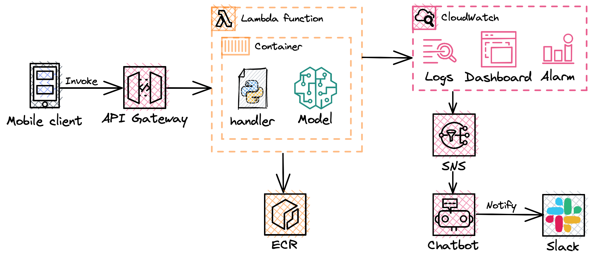

# Monitoring of Lambda ML inference with CloudWatch Dashboard
**Table of Contents**

- [Workspace requirements](#workspace-requirements)
  * [Problem Context](#problem-context)
  * [Functional requirements](#functional-requirements)
  * [Non-functional requirements](#non-functional-requirements)
- [Proposed solution](#proposed-solution)
  * [Architecture diagram](#architecture-diagram)
  * [Cost breakdown](#cost-breakdown)

## Workspace requirements

### Problem Context
Data Science team wants to create ML model inference without managing underlying resources. Demand is unpredictable and can vary during the day. Team suggested customers are using this functionality right after sleep or before going to the bed. The feature is in beta testing and team cannot predict how popular it will be. Mobile app calls new functionality via API Gateway. Team also want to monitor inference and model metrics and receive alerts via Slack.

For testing purposes, you can use example model in [CDK assets](cdk-assets/).

### Functional requirements
- **FR-1** Solution provides inference for ML model.
- **FR-2** Solution can be called via API request to API Gateway.
- **FR-3** Solution should send notifications to Slack channel. 
- **FR-4** Solution should include dashboard for monitoring performance metrics. 

### Non-functional requirements
- **NFR-1** Solution should not require underlying resources management.
- **NFR-3** Solution should be cost-effective.
- **NFR-3** Solution should be able to scale in/out as the data volumes may vary during the day.
- **NFR-4** Structured and centralised logs should be implemented.
- **NFR-5** Model inference should give prediction within 10 seconds.

## Proposed solution

### Architecture diagram

> 💡 *Everything in software architecture is a trade-off. First Law of Software Architecture*

All resources will be deployed as a Stack to allow centralised creation, modification and deletion of resources in any account. 

The process is the following:

- Client uses mobile app and requests advice for improving his sleep (prediction)
- This API request goes to API Gateway, which triggers Lambda function (inference)
- Lambda function pulls image from ECR and launches container
- Lambda handler loads model, makes prediction and sends metrics to CLoudWatch
- CloudWatch displays all metrics described below in a Dashboard
- CloudWatch alert is triggered when one of the metrics passes threshold
- CloudWatch Alert action is to send message to the SNS topic
- ChatBot monitors SNS topic and sends notifications to Slack

The following metrics will be displayed in CloudWatch Dashboard:

- Lambda: Number of invocations and errors (count)
- Model: Model prediction probability 
- Lambda: Maximum memory used (MB)
- Lambda: Initialization Time (ms)

All infrastructure components are prepared using IaC tool - AWS CDK.

[CDK assets](cdk-assets/) 

### Cost breakdown

| Service in EU (Frankfurt) | Configuration | Monthly cost |
| --- | --- | --- |
| AWS Lambda | Memory allocated 250 MB, 600,000 total compute seconds (monthly), amount of ephemeral storage allocated 512 MB  | $2.48 |
| Amazon CloudWatch  | Number of: metrics 1, Lambda Insights 200,000 requests, dashboards 1, standard alarm 1  | $2.93 |
| Amazon API Gateway  | Requests per month 200,000 with average size of 50 KB | $0.24 |
| Amazon ECR  | Data stored  per month 1 GB | $0.10 |
| Amazon SNS  | Requests per month 1,000 | $0.00 |
|TOTAL COST |  | $5.75 |